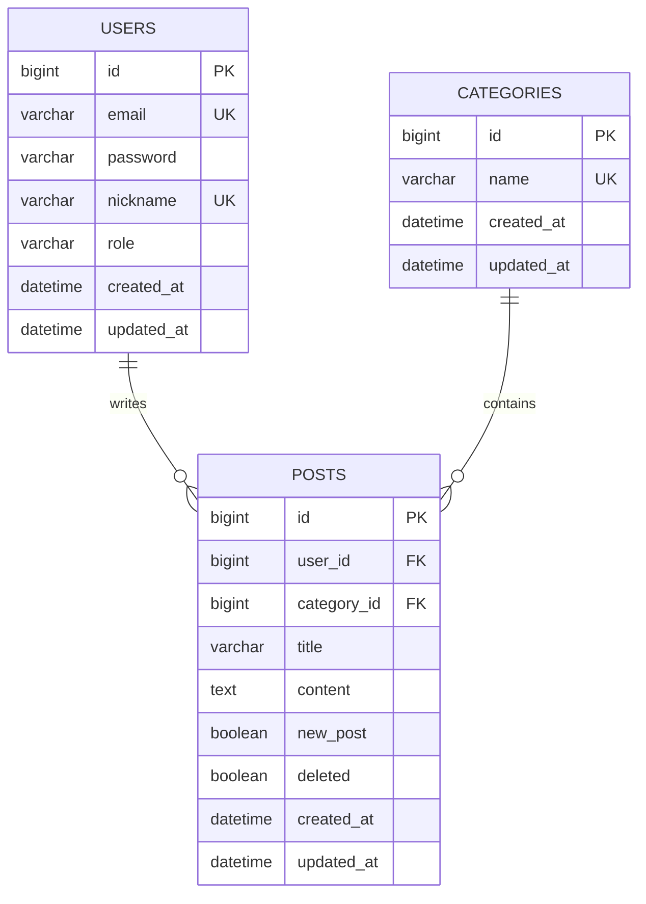

# AskTeacher

AskTeacher는 사용자가 질문 게시글을 작성하고 조회할 수 있는 Q&A 기반 백엔드 API 프로젝트입니다.

현재 1차 구현 범위에서는 회원가입, 로그인, 카테고리 조회, 게시글 작성/목록/상세/수정/삭제 기능을 제공합니다. 인증 토큰 기반 권한 처리, 댓글, 검색, 페이징, 배포는 추후 확장 범위로 분리했습니다.

## 기술 스택

| 구분 | 기술 |
|---|---|
| Language | Java 17 |
| Framework | Spring Boot 4.0.6 |
| Web | Spring WebMVC |
| ORM | Spring Data JPA |
| Security | Spring Security, BCrypt |
| Validation | Jakarta Validation |
| Database | H2, MySQL Connector |
| Test | JUnit 5, Spring Boot Test, AssertJ |
| Build Tool | Gradle |
| 기타 | Lombok, `.http` 수동 API 테스트 파일 |

## 주요 기능

### 인증

- 회원가입
  - 이메일, 비밀번호, 닉네임 입력
  - 이메일/닉네임 중복 검증
  - 비밀번호 BCrypt 암호화 저장
- 로그인
  - 이메일/비밀번호 검증
  - 로그인 성공 시 사용자 식별 정보 반환

### 카테고리

- 카테고리 목록 조회
- 애플리케이션 실행 시 기본 카테고리 자동 생성
  - Java
  - Spring
  - Database
  - Git
  - 기타

### 게시글

- 게시글 작성
  - 작성자 ID, 카테고리 ID, 제목, 내용 기반 생성
  - 새 게시글은 `newPost = true`, `deleted = false`로 생성
- 게시글 목록 조회
  - 삭제되지 않은 게시글만 조회
  - `createdAt` 기준 내림차순 정렬
- 게시글 상세 조회
  - 작성자명, 카테고리명, 제목, 내용, 생성일 조회
- 게시글 수정
  - 요청 `userId`와 게시글 작성자 ID를 비교해 작성자 검증
  - 카테고리, 제목, 내용 수정
  - JPA Dirty Checking으로 변경 반영
- 게시글 삭제
  - 물리 삭제가 아닌 Soft Delete 방식
  - `deleted = true`로 변경
  - 이미 삭제된 게시글은 조회되지 않는 게시글과 동일하게 처리

## 프로젝트 구조

```text
src/main/java/com/github/marcel615/askteacher
├── domain
│   ├── auth
│   │   ├── controller
│   │   ├── dto
│   │   └── service
│   ├── category
│   │   ├── controller
│   │   ├── dto
│   │   ├── entity
│   │   ├── repository
│   │   └── service
│   ├── post
│   │   ├── controller
│   │   ├── dto
│   │   ├── entity
│   │   ├── repository
│   │   └── service
│   └── user
│       ├── entity
│       ├── repository
│       └── type
├── global
│   ├── config
│   ├── exception
│   ├── init
│   └── response
└── http
    ├── auth
    ├── category
    └── post
```

## ERD



## API 명세

공통 성공 응답 형식:

```json
{
  "status": 200,
  "message": "요청에 성공했습니다.",
  "data": {}
}
```

공통 에러 응답 형식:

```json
{
  "status": 400,
  "message": "에러 메시지"
}
```

| 기능 | Method | URL | 설명 |
|---|---|---|---|
| 회원가입 | POST | `/api/auth/signup` | 사용자 생성 |
| 로그인 | POST | `/api/auth/login` | 이메일/비밀번호 로그인 |
| 카테고리 목록 조회 | GET | `/api/categories` | 게시글 카테고리 목록 조회 |
| 게시글 작성 | POST | `/api/posts` | 질문 게시글 생성 |
| 게시글 목록 조회 | GET | `/api/posts` | 삭제되지 않은 게시글 목록 조회 |
| 게시글 상세 조회 | GET | `/api/posts/{postId}` | 게시글 상세 정보 조회 |
| 게시글 수정 | PATCH | `/api/posts/{postId}` | 작성자 검증 후 게시글 수정 |
| 게시글 삭제 | DELETE | `/api/posts/{postId}` | 게시글 soft delete |

자세한 API 요청/응답 예시는 [`docs/api-spec.md`](docs/api-spec.md)를 참고합니다.

## 실행 방법

### 사전 준비

- Java 17
- Gradle Wrapper 사용

### 애플리케이션 실행

Windows:

```bash
./gradlew.bat bootRun
```

macOS/Linux:

```bash
./gradlew bootRun
```

기본 실행 주소:

```text
http://localhost:8080
```

### H2 Console

```text
URL: http://localhost:8080/h2-console
JDBC URL: jdbc:h2:mem:askteacher
Username: sa
Password:
```

### 테스트 실행

Windows:

```bash
./gradlew.bat test
```

macOS/Linux:

```bash
./gradlew test
```

### 수동 API 확인

프론트엔드가 없는 동안 `.http` 파일로 API를 수동 확인합니다.

```text
src/main/java/com/github/marcel615/askteacher/http
├── auth
├── category
└── post
```

## 트러블슈팅

### 로그인 사용자 조회 로직 개선

초기 로그인 로직은 이메일 존재 여부 확인과 사용자 조회를 분리해 같은 조건의 DB 조회가 두 번 발생했습니다. 이를 `findByEmail()` 한 번으로 조회하고, `Optional<User>.orElseThrow()`로 예외 처리를 함께 수행하도록 개선했습니다.

그 결과 DB 접근이 줄고, "사용자가 없을 수 있다"는 의도가 코드에 더 명확하게 드러났습니다.

### Soft Delete 처리

게시글 삭제는 DB row를 제거하지 않고 `deleted = true`로 변경합니다. 목록 조회와 삭제 대상 조회에서는 삭제된 게시글을 제외해 사용자 입장에서는 존재하지 않는 게시글처럼 처리합니다.

### 인증/인가 범위 제한

현재는 JWT 기반 인증/인가를 구현하지 않았습니다. 게시글 수정의 작성자 검증은 임시로 request body의 `userId`와 게시글 작성자 ID를 비교하는 방식으로 처리합니다. 추후 인증 기능 도입 시 인증 사용자 기준 검증으로 변경할 예정입니다.

## 배운 점

- Issue 단위로 요구사항, API 명세, ERD, 구현 범위를 먼저 정리하면 기능 범위가 커지는 것을 막을 수 있었다.
- Spring Data JPA 메서드 네이밍만으로 삭제 제외 및 생성일 내림차순 조회를 간결하게 구현할 수 있었다.
- 게시글 수정은 별도 update query 없이 JPA Dirty Checking으로 처리할 수 있었다.
- Soft Delete를 적용할 때는 삭제 로직뿐 아니라 목록 조회, 상세 조회, 재삭제 처리 정책까지 함께 정해야 한다는 점을 확인했다.
- 인증/인가가 없는 단계에서 작성자 검증을 어떻게 임시 처리할지 명확히 문서화하는 것이 중요했다.

## 향후 개선 사항

- JWT 기반 인증/인가 도입
- 게시글 수정/삭제 작성자 검증을 인증 사용자 기준으로 변경
- 댓글 CRUD
- 게시글 검색 및 페이징
- Controller/WebMvc 테스트 보강
- 배포 환경 구성
